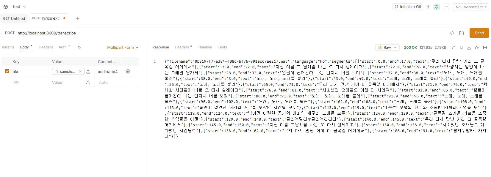

# spring-ai-lyrics-extractor

Spring Boot, FastAPI, ffmpeg, faster-whisper, Ollama를 사용한 **로컬 AI 가사 초안 추출 프로젝트**입니다.

사용자가 `mp3`, `wav`, `m4a` 오디오 파일을 업로드하면 Python AI Worker가 STT를 수행하고, Spring Boot backend가 결과를 구조화된 JSON으로 반환합니다.

> 현재 Ollama 후처리는 코드 구조만 준비되어 있으며, 실제 LLM 후처리 호출은 아직 활성화되어 있지 않습니다.

## 실행 결과

### Bruno API 테스트 결과



## 주요 기능

- 오디오 파일 업로드 API
- `multipart/form-data` 기반 파일 처리
- Spring MVC `MultipartFile` 수신
- `ByteArrayResource`를 사용한 Python Worker multipart 재전송
- FastAPI 기반 STT Worker
- ffmpeg 기반 wav 변환
- faster-whisper 기반 음성 인식
- Java `record` DTO 기반 JSON 응답
- 로컬 Ollama 후처리 확장 구조

## 아키텍처

```text
사용자
→ Spring Boot backend
→ Python FastAPI ai-worker
→ ffmpeg
→ faster-whisper
→ Spring Boot backend
→ Ollama 후처리 예정
→ JSON 응답
```

자세한 구조는 [docs/architecture.md](docs/architecture.md)를 참고하세요.

## 기술 스택

### Backend

- Java 21
- Spring Boot
- Spring Web
- Spring Validation
- Spring AI Ollama
- Gradle

### AI Worker

- Python 3.10+
- FastAPI
- faster-whisper
- ffmpeg-python
- uvicorn

### Local AI

- Ollama
- `qwen2.5:7b` 또는 `llama3.1:8b`

## 프로젝트 구조

```text
spring-ai-lyrics-extractor/
├── backend/
│   ├── build.gradle
│   ├── settings.gradle
│   └── src/main/
│       ├── java/com/example/lyricsextractor/
│       └── resources/application.yml
├── ai-worker/
│   ├── app.py
│   ├── audio_utils.py
│   ├── transcriber.py
│   └── requirements.txt
├── docs/
│   └── architecture.md
├── samples/
└── README.md
```

## 실행 전 준비물

- Java 21
- Python 3.10+
- ffmpeg
- Ollama

기본 Ollama 모델 설치:

```bash
ollama pull qwen2.5:7b
```

## 실행 방법

### 1. ai-worker 실행

```bash
cd ai-worker
python -m venv .venv
.venv\Scripts\activate
pip install -r requirements.txt
uvicorn app:app --reload --port 8000
```

헬스 체크:

```bash
curl http://localhost:8000/health
```

예상 응답:

```json
{
  "status": "ok"
}
```

### 2. backend 실행

```bash
cd backend
.\gradlew.bat bootRun
```

backend 기본 주소:

```text
http://localhost:8080
```

## API

### 가사 초안 추출

```http
POST /api/lyrics/extract
Content-Type: multipart/form-data
```

요청 필드:

| 이름 | 타입 | 필수 | 설명 |
| --- | --- | --- | --- |
| `file` | file | 예 | 오디오 파일. `mp3`, `wav`, `m4a` 지원 |

curl 예시:

```bash
curl -X POST http://localhost:8080/api/lyrics/extract ^
  -F "file=@samples/sample.m4a"
```

응답 예시:

```json
{
  "filename": "sample.wav",
  "language": "ko",
  "lines": [
    {
      "start": 0.0,
      "end": 4.2,
      "text": "전사된 텍스트"
    }
  ],
  "warnings": [
    "현재는 Ollama 후처리 로직이 TODO 상태입니다."
  ]
}
```

## 현재 구현 상태

구현됨:

- Spring Boot 파일 업로드 API
- 업로드 파일 검증
- Spring Boot에서 FastAPI로 multipart 파일 전달
- FastAPI `/transcribe` 엔드포인트
- 오디오 파일 저장
- ffmpeg wav 변환
- faster-whisper 전사
- 구조화된 JSON 응답

아직 구현되지 않음:

- 실제 Ollama 후처리 호출
- Spring AI `.entity()` 기반 구조화 출력 매핑
- Spring AI Advisor 적용
- Chat Memory와 `conversationId`
- Demucs 보컬 분리
- YouTube URL 지원
- 결과 저장 기능

## Python Worker를 분리한 이유

Spring Boot는 API 계층, 요청 검증, 서비스 흐름, DTO 응답 처리에 적합합니다. 반면 `faster-whisper`, `ffmpeg`, 향후 추가할 Demucs 같은 오디오 AI 도구는 Python 생태계에서 다루는 것이 더 실용적입니다.

또한 Ollama는 이 프로젝트에서 STT 엔진이 아니라 **전사된 텍스트를 가사 초안 형태로 정리하는 후처리 모델**로 사용할 예정입니다. 노래 가사 추출은 반주, 리버브, 코러스, 발음 뭉개짐 때문에 일반 음성 인식보다 어렵기 때문에 STT 전용 모델인 faster-whisper를 먼저 사용합니다.

## 학습 포인트

이 프로젝트는 Spring AI 멀티모달 수업에서 배운 파일 입력 흐름을 바탕으로 만들었습니다.

적용한 개념:

- `multipart/form-data`
- `MultipartFile`
- `ByteArrayResource`를 통한 `Resource` 변환
- 파일 타입 검증
- Java `record` DTO 기반 구조화 응답

수업 예제처럼 오디오 파일을 LLM에 직접 `.media()`로 보내는 방식은 아직 사용하지 않았습니다. 대신 오디오 STT를 Python Worker로 분리하고, Ollama는 후처리 역할로 붙일 수 있도록 구조를 잡았습니다.

수업 연결 정리는 [docs/spring-ai-day4-notes.md](docs/spring-ai-day4-notes.md)를 참고하세요.

## 앞으로 할 일

- [ ] 실제 Ollama 후처리 연결
- [ ] `.entity()` 기반 구조화 LLM 응답 적용
- [ ] 400, 413 에러 응답 정리
- [ ] 처리 후 임시 오디오 파일 정리
- [ ] Demucs 보컬 분리 추가
- [ ] 결과 저장 기능 추가
- [ ] 간단한 파일 업로드 UI 추가